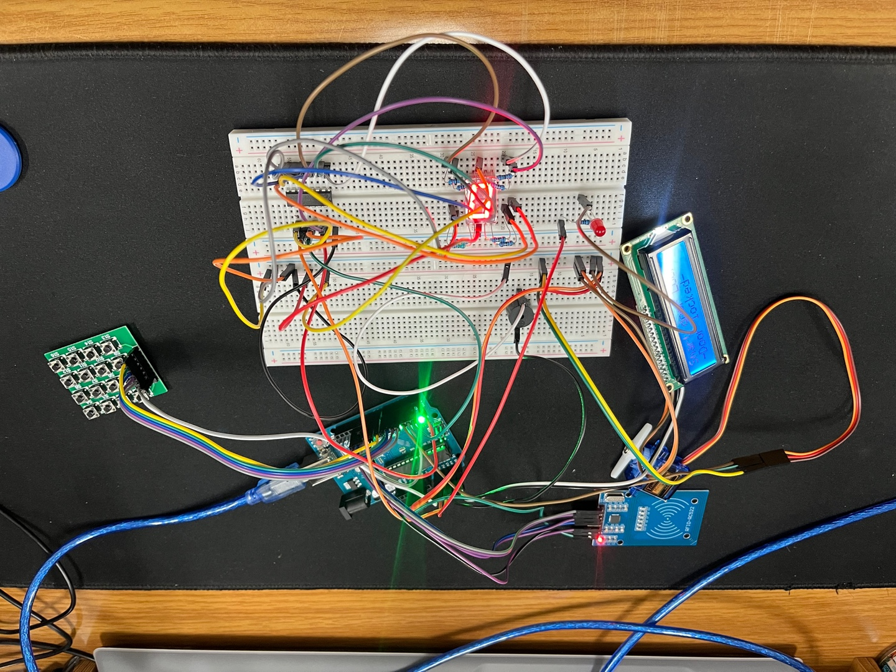
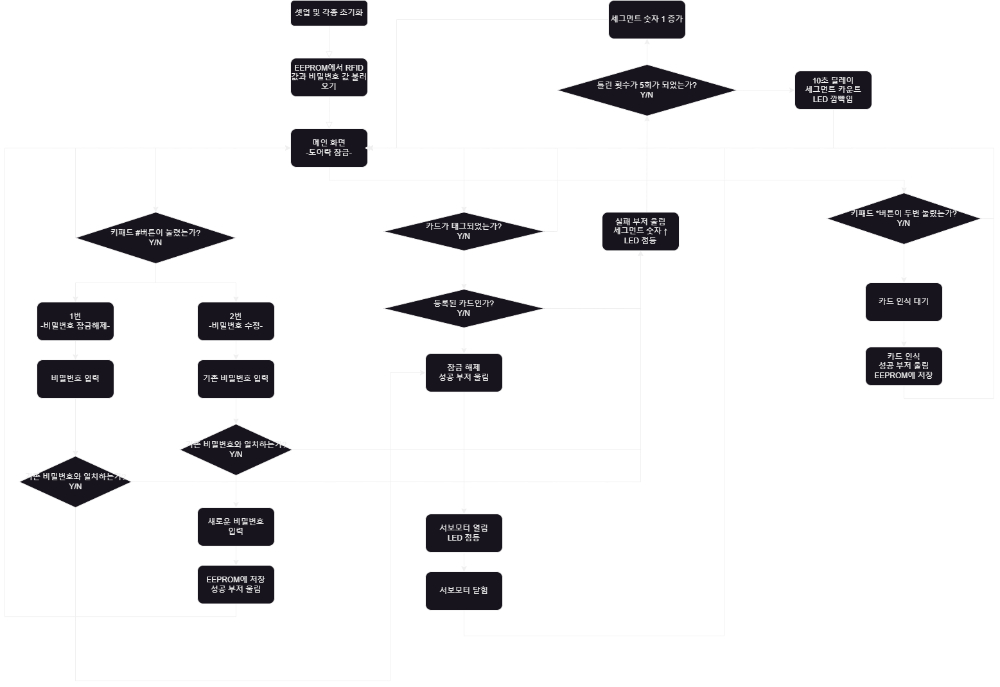
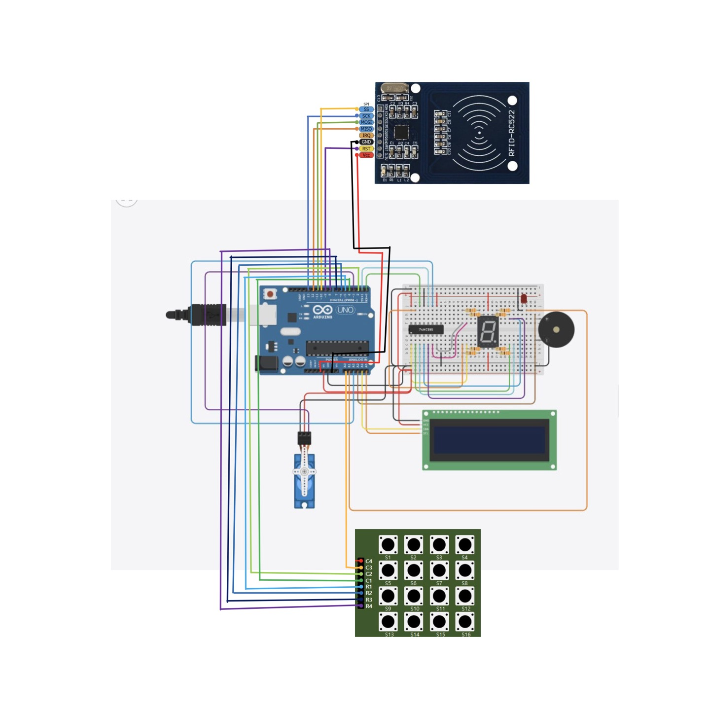

## Arduino Auto Door System

  - 이 프로젝트는 Arduino를 활용하여 비밀번호와 RFID 인증 기반의 스마트 도어락 시스템을 구축한 것으로, 사용자 친화적인 인터페이스와 다양한 보안 기능을 제공합니다.


<br><br>

## 📁 프로젝트 간략 소개

- **Arduino 보드**를 기반으로 비밀번호와 RFID 인증을 활용한 자동화된 도어락 시스템.
- 사용자 비밀번호와 RFID 태그 데이터를 **EEPROM**에 저장하여 재부팅 후에도 데이터 유지.
- **LCD 디스플레이**와 **7-세그먼트 디스플레이**를 통해 실시간 상태 표시.

## 💻 프로젝트 내용

### 🎯 목적
- 보안과 편의성을 동시에 제공하는 스마트 도어락 시스템 구축.

### 🕵️ 문제
- 기존 물리적 키 중심의 도어락은 분실 및 복제가 용이.
- 재부팅 시 데이터 손실 문제로 사용자 경험 저하.

### 🎣 목표
- a. RFID 및 비밀번호 인증 기반 도어락 구현.
- b. EEPROM을 활용한 데이터 저장 및 유지.
- c. LCD와 LED를 통한 실시간 상태 및 알림 제공.

## 🗂️ 파일 구성

```
AutoDoorSystem/
├── src/
│   ├── main.ino             # 주요 Arduino 코드
│   ├── Control_Pwd.h        # 비밀번호 입력 및 제어
│   ├── KeyMatrix.h          # 키패드 구성
│   ├── LCD.h                # LCD 관리
│   ├── Motor.h              # 서보 모터 제어
│   ├── Sound.h              # 버저 제어
│   └── 7Segment.h           # 7-세그먼트 디스플레이
└── README.md                # 프로젝트 설명 파일
```

## 🛠️ 기술 스택

### **하드웨어**
- **Arduino 보드**
- **RFID 리더**: SPI 인터페이스
- **EEPROM**: 데이터 저장
- **키패드 매트릭스**: 디지털 핀 입력
- **LCD 디스플레이**: I2C 연결
- **서보 모터**: PWM 핀 제어
- **7-세그먼트 디스플레이**: 상태 표시
- **피에조 버저**: 디지털 핀 제어

### **소프트웨어**
- **프로그래밍 언어**: C++
- **Arduino IDE**: 개발 환경
- **EEPROM 라이브러리**: 데이터 저장

## 📊 시스템 구성도

- **시스템 구성**


<br><br>

- **블록 다이어그램**


<br><br>

```

### 👇 Let's Connect

[](https://github.com/Kwonsiwoo2)  [](https://www.linkedin.com/in/%EC%8B%9C%EC%9A%B0-%EA%B6%8C-064765341/)

